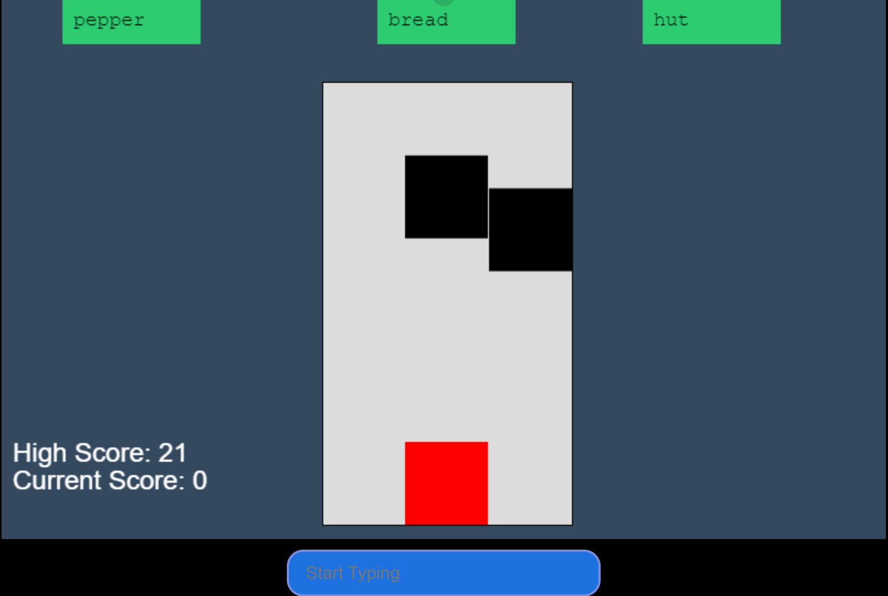

# Marist Hackathon Fall 2024 🏆 WINNER 🏆 - TypeDash

Created by Chrisitan Farrell and Ryan Munger

## Installation
1. Ensure you have node installed on your computer
2. `npm install` 
3. `npm run dev`
4. Go to localhost in the browser!
5. Ensure you are in the right zoom level in your browser.

## About the Project
This project was for the Marist Hackathon in the Fall of 2024. The theme was 'typing,' and we were given 12 hours to complete a fully-fledged project that would be judged. 

We decided to build a fun interactive game with roots in similar games such as Subway Surfers and Piano Tiles. 

I decided to get some good experience in Javascript by developing this project solely using Javascript and the node package 'Phaser'. The project is hosted and runs via Vite.

This project won first place during judging 🏆.

## How to Play  
1. You can type the word in the box (case insensitive) for the column you wish to move to.
2. You can only move one hop at a time (ex. left to middle, to go left to right you must pass through the middle first).
3. Dodge the obstacles! In this case, we want to avoid the left column.

4. The obstacles speed up, so stay alert!
5. Have Fun!
